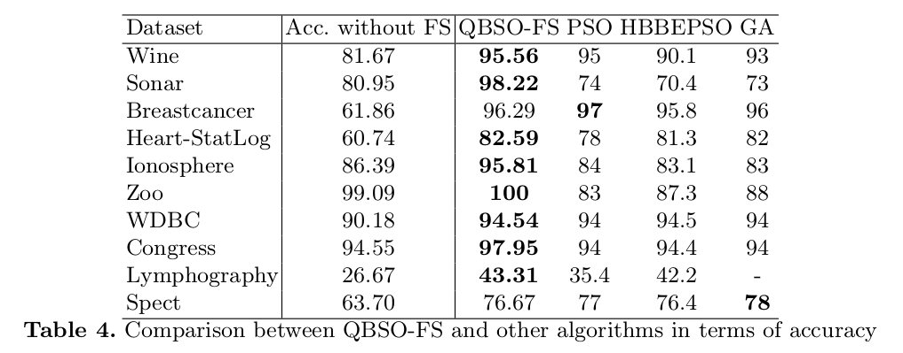

# QBSO-FS : a Reinforcement Learning based Bee Swarm Optimization metaheuristic for Feature Selection

This is the official Python implementation of the paper:

*QBSO-FS : a Reinforcement Learning based Bee Swarm Optimization metaheuristic for Feature Selection* <https://doi.org/10.1007/978-3-030-20518-8_65>

by Sadeg et al. (IWANN2019)



## Requirements 

*1.* Download current version of the repository. ( Or refer to point 3 if you want to use a Jupyter Notebook )<br>

```
git clone https://github.com/amineremache/qbso-fs.git
```

*2.* Install the dependencies in the `requirements.txt` file.<br>
```
pip install -r requirements.txt
``` 

or 

```
pip install numpy scikit-learn pandas xlsxwriter
```

*3.* If you don't want to use the code locally, or you want to run it from a notebook, you can run one of the notebooks present at `./notebooks/`.<br>


The code was tested on Ubuntu 16 and 18, Windows 10 with Python 3.6 and 3.7.

## Running the code

To run the code, just go to `main.py`. For now, only KNN is implemented, but you can add your own classifier in `fs_problem.py` file.

# Citation

If you use this work, please cite:<br/>
*QBSO-FS: A Reinforcement Learning Based Bee Swarm Optimization Metaheuristic for Feature Selection*, Sadeg S., Hamdad L., Remache A.R., Karech M.N., Benatchba K., Habbas Z, IWANN, 2019.